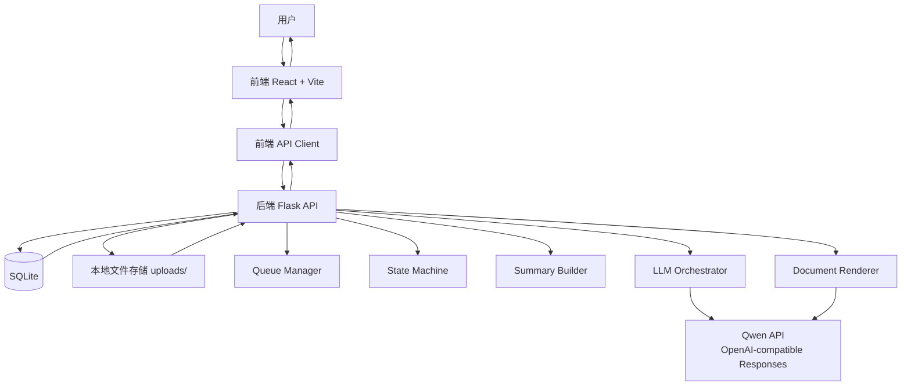
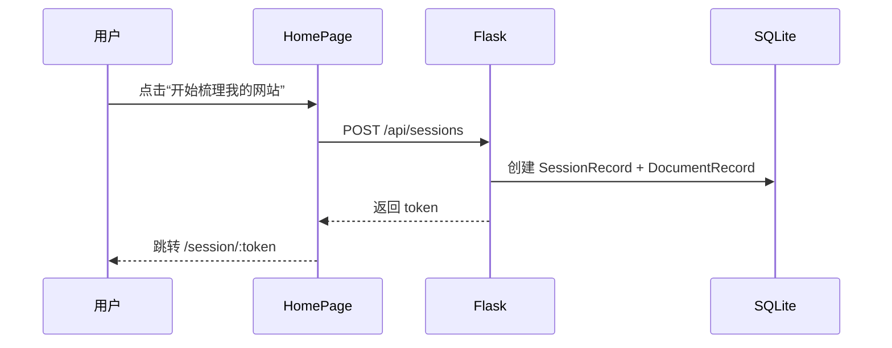
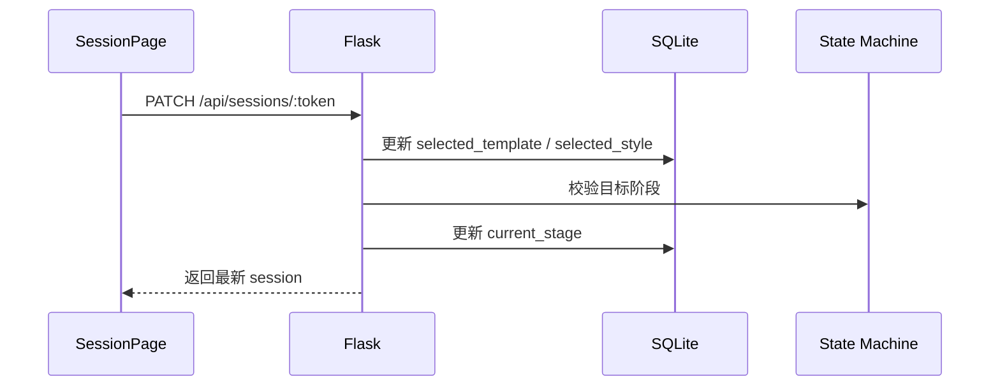
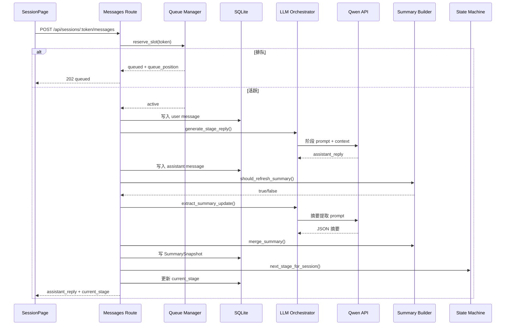
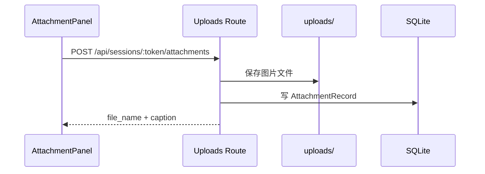
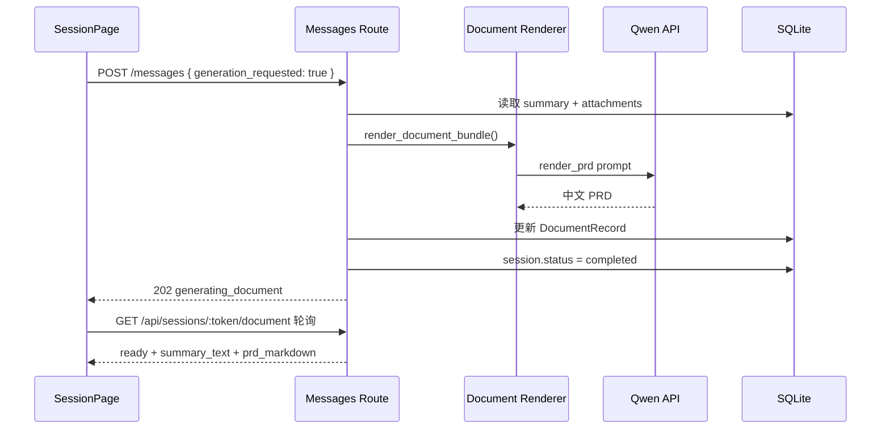

# ARCHITECTURE.md

## 目标
本文档描述当前 MVP 的实际架构，而不是理想化设计。内容以仓库现状和已完成验证为准。

适用范围：
- 首页认知页
- 需求梳理页
- 真实 LLM 对话引导
- 中文摘要与 PRD 生成
- SQLite 持久化
- 上传、排队、轮询与回访

---

## 1. 系统概览



---

## 2. 模块分层

### 前端

#### 页面层
- [frontend/src/routes/home-page.tsx](/Users/zzten/work/zzetzMain/frontend/src/routes/home-page.tsx)
  - 首页五段式内容
  - 创建 session 并跳转到 `/session/:token`
- [frontend/src/routes/session-page.tsx](/Users/zzten/work/zzetzMain/frontend/src/routes/session-page.tsx)
  - 模板/风格选择
  - 对话发送
  - 附件上传
  - 3 秒 session 轮询
  - 5 秒 document 轮询
  - 进入 `generate` 后自动请求 PRD 生成

#### 组件层
- [frontend/src/components/home/](/Users/zzten/work/zzetzMain/frontend/src/components/home)
  - `Hero`
  - `Problem`
  - `Process`
  - `OutputPreview`
  - `FinalCta`
- [frontend/src/components/intake/](/Users/zzten/work/zzetzMain/frontend/src/components/intake)
  - `StepHeader`
  - `TemplateSelector`
  - `StyleSelector`
  - `ChatPanel`
  - `AttachmentPanel`
  - `SummaryPanel`

#### 接口层
- [frontend/src/lib/api.ts](/Users/zzten/work/zzetzMain/frontend/src/lib/api.ts)
  - `createSession`
  - `getSession`
  - `updateSession`
  - `sendMessage`
  - `uploadAttachment`
  - `getDocument`
- [frontend/src/lib/types.ts](/Users/zzten/work/zzetzMain/frontend/src/lib/types.ts)
  - session / message / attachment / document 类型契约

### 后端

#### 应用入口
- [backend/app/__init__.py](/Users/zzten/work/zzetzMain/backend/app/__init__.py)
  - Flask app 初始化
  - CORS
  - config 加载
  - 数据库初始化
  - 路由注册

#### 路由层
- [backend/app/routes/health.py](/Users/zzten/work/zzetzMain/backend/app/routes/health.py)
  - 健康检查
- [backend/app/routes/sessions.py](/Users/zzten/work/zzetzMain/backend/app/routes/sessions.py)
  - 创建 / 查询 / 更新 session
- [backend/app/routes/messages.py](/Users/zzten/work/zzetzMain/backend/app/routes/messages.py)
  - 用户消息入口
  - LLM 回复
  - 摘要提取
  - 阶段推进
  - PRD 生成请求
- [backend/app/routes/uploads.py](/Users/zzten/work/zzetzMain/backend/app/routes/uploads.py)
  - 附件上传
- [backend/app/routes/documents.py](/Users/zzten/work/zzetzMain/backend/app/routes/documents.py)
  - 文档读取

#### 服务层
- [backend/app/services/llm_client.py](/Users/zzten/work/zzetzMain/backend/app/services/llm_client.py)
  - 调 OpenAI-compatible `/responses`
  - 中文错误包装
  - 超时自动重试一次
- [backend/app/services/llm_orchestrator.py](/Users/zzten/work/zzetzMain/backend/app/services/llm_orchestrator.py)
  - 分阶段 prompt 拼装
  - 阶段回复
  - 摘要提取
  - PRD 渲染
- [backend/app/services/intake_state_machine.py](/Users/zzten/work/zzetzMain/backend/app/services/intake_state_machine.py)
  - `template -> style -> positioning -> content -> features -> generate`
- [backend/app/services/summary_builder.py](/Users/zzten/work/zzetzMain/backend/app/services/summary_builder.py)
  - 是否刷新摘要
  - 摘要合并
- [backend/app/services/queue_manager.py](/Users/zzten/work/zzetzMain/backend/app/services/queue_manager.py)
  - 最多 5 个活跃会话
  - 超出后进入排队
- [backend/app/services/document_renderer.py](/Users/zzten/work/zzetzMain/backend/app/services/document_renderer.py)
  - 文档生成封装
- [backend/app/services/storage.py](/Users/zzten/work/zzetzMain/backend/app/services/storage.py)
  - 上传文件保存与路径管理

#### 数据层
- [backend/app/models.py](/Users/zzten/work/zzetzMain/backend/app/models.py)
  - `SessionRecord`
  - `MessageRecord`
  - `SummarySnapshot`
  - `DocumentRecord`
  - `AttachmentRecord`
- [backend/app/db.py](/Users/zzten/work/zzetzMain/backend/app/db.py)
  - SQLAlchemy engine / session 管理

#### Prompt 层
- [backend/app/prompts/](/Users/zzten/work/zzetzMain/backend/app/prompts)
  - `system.md`
  - `template.md`
  - `style.md`
  - `positioning.md`
  - `content.md`
  - `features.md`
  - `extract_summary.md`
  - `render_prd.md`

---

## 3. 核心数据流

### 3.1 创建会话



### 3.2 模板与风格选择



### 3.3 对话推进与摘要提取



### 3.4 附件上传



### 3.5 PRD 生成



---

## 4. 状态模型

### 会话状态
- `draft`
- `queued`
- `active`
- `generating_document`
- `completed`
- `failed`

### 梳理阶段
- `template`
- `style`
- `positioning`
- `content`
- `features`
- `generate`

---

## 5. 数据存储

### SQLite
当前数据库为 SQLite，核心表职责如下：

- `sessions`
  - 当前阶段
  - 当前状态
  - 模板/风格选择
  - 错误状态
- `messages`
  - 用户消息
  - 助手消息
  - 所属阶段
- `summary_snapshots`
  - 每轮结构化摘要快照
- `documents`
  - 文档状态
  - 摘要文本
  - PRD markdown
  - 版本号
- `attachments`
  - 文件名
  - caption
  - 文件路径

### 文件存储
- 上传文件保存在 `backend/uploads/`
- 以 token 命名空间隔离
- 当前主要用于参考图输入，不做对象存储抽象

---

## 6. 前端轮询策略

- session 轮询：3 秒
  - 读取当前阶段
  - 读取 session 状态
  - 读取结构化摘要
- document 轮询：5 秒
  - 在 `generating_document`
  - 以及已完成回访时
  - 读取文档状态与摘要

设计原因：
- 遵守项目约束，优先轮询，不做 WebSocket
- 保持实现简单，便于 MVP 验证与回滚

---

## 7. 容错与边界

### 已实现
- LLM HTTP 错误转为中文 RuntimeError
- LLM 超时自动重试一次
- 阶段回复与摘要提取超时窗口已按真实供应商耗时调高
- 第 6 个活跃会话进入排队
- 上传类型限制：PNG / JPEG / WEBP
- 上传文件名走 `secure_filename`
- 非法 token 返回中文 404

### 当前已知边界
- 真实 LLM 响应偏慢，阶段推进可能需要几十秒到一百秒级
- 已完成会话重新打开时，附件列表不会自动回放到附件面板，但 PRD 中会保留 `参考附件` 段落
- 当前是单机 SQLite + 本地文件存储，适合 MVP，不适合作为高并发生产方案

---

## 8. 目录对照

```text
frontend/
├── src/app.tsx
├── src/routes/
│   ├── home-page.tsx
│   └── session-page.tsx
├── src/components/home/
├── src/components/intake/
└── src/lib/

backend/
├── app/__init__.py
├── app/routes/
├── app/services/
├── app/prompts/
├── app/models.py
├── app/db.py
├── app.db
└── uploads/
```

---

## 9. 运行方式

### 前端
```bash
cd frontend
npm install
npm run dev
```

### 后端
```bash
cd backend
pip install -e .
python run.py
```

### 验证
```bash
cd backend && pytest -q
cd frontend && npm test
cd frontend && npm run build
```

---

## 10. 后续演进建议

如果继续演进，优先级建议如下：

1. 把文档生成改成真正的后台任务模型，降低单请求阻塞时间
2. 增加历史消息回放与附件回放
3. 为 LLM 慢响应增加更细的阶段性状态提示
4. 抽象存储层，为 SQLite -> PostgreSQL、local uploads -> object storage 留接口
5. 为运维与排查增加结构化日志与 request tracing
